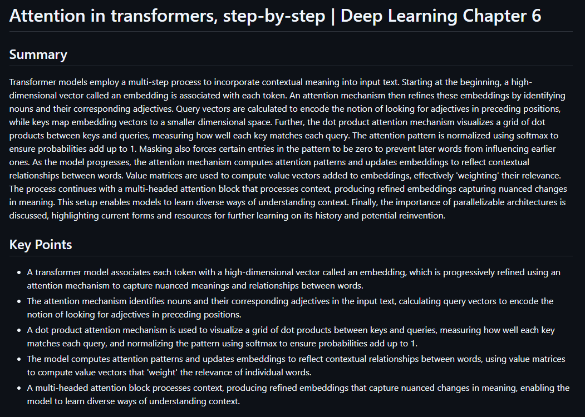

<div align="center">

# reko

**Make YouTube videos readable** 🎥

_A modern, local-first CLI tool to extract transcripts from YouTube and transform them into concise summaries and key points._

[](https://opensource.org/licenses/MIT)
[](https://pypi.org/project/reko-yt/)
[](https://www.python.org/downloads/)

</div>

## ✨ What is reko?

`reko` is a command-line tool that converts YouTube videos into clean Markdown summaries using transcripts and Large Language Models.

Give it a video URL, a playlist, or a file containing multiple URLs, and `reko` will fetch the transcript, summarize the content in manageable chunks, and generate a readable Markdown document with a summary and optional key points.

It’s designed to be simple, fast, and automation-friendly, making it easy to extract useful information from long, informational videos.  
By default, `reko` is local-first and privacy-friendly when used with Ollama, while still supporting paid cloud models when needed.

<p align="center">
  
</p>

## 🚀 Features

- Generate clean Markdown summaries with optional key points.
- Summarize a single video, a playlist, or a batch of URLs.
- Optimized for Small Language Models (SLMs), which are often sufficient for high-quality summarization.
- Works with Ollama and cloud providers via APIs.
- Multi-language summaries: uses native transcripts when available, with automatic fallback and translation.
- Handles long videos via transcript chunking.
- Skips reprocessing when a summary already exists (with an option to force regeneration).

## 🧠 How it works

At a high level, `reko` follows a simple pipeline:

1. Resolve the input target (video, playlist, or file).
2. Fetch the YouTube transcript in the requested language, with fallback and translation when needed.
3. Split the transcript into word-based chunks.
4. Summarize each chunk independently.
5. Merge chunk summaries into a coherent final result.
6. Output a Markdown file and/or print to stdout.
7. Optionally extract key points from the generated summary.

This approach allows `reko` to scale smoothly from short clips to multi-hour videos.

## 📦 Installation

### Prerequisites

- **Python 3.10+**
- An LLM endpoint:
  - **Ollama** (local): install Ollama and pull the model you want to use.
  - **Hosted APIs** (for example `openai/...`): configure the required API keys in your environment. When using non-local providers, the required environment variables must be configured according to the supported provider of the model which can be found [here](https://docs.litellm.ai/docs/providers).

### Install from PyPI

```bash
pip install reko-yt
```

## ⚡ Quick start

Show available commands:

```bash
reko --help
reko summarize --help
```

> [!NOTE]
> Small Language Models are a great default for most summarization tasks.

Summarize a single YouTube video (prints and saves by default):

```bash
reko summarize 'https://www.youtube.com/watch?v=eMlx5fFNoYc' 'ollama/llama3.2:3b'
reko summarize 'https://www.youtube.com/watch?v=eMlx5fFNoYc' 'openai/gpt-5-nano'
```

Generate key points only, in Italian, without saving to disk:

```bash
reko summarize 'https://www.youtube.com/watch?v=eMlx5fFNoYc' \
  'ollama/llama3.2:3b' \
  --length short \
  --language it \
  --key-points-only \
  --print-only
```

Summarize a playlist or a batch of URLs:

```bash
reko summarize 'https://www.youtube.com/playlist?list=PL908547EAA7E4AE74' 'ollama/llama3.2:3b'
reko summarize urls.txt 'ollama/llama3.2:3b'
```

> [!WARNING]
> When processing playlists or large batches, YouTube may temporarily rate-limit your IP.  
> Using a proxy is recommended for high-volume usage.

Use a remote Ollama instance:

```bash
reko summarize 'https://www.youtube.com/watch?v=eMlx5fFNoYc' 'ollama/llama3.2:3b' --host 'http://YOUR_OLLAMA_HOST:11434'
```

## 🌐 Local web UI

Start a local web page that can summarize a YouTube URL and render the Markdown:

```bash
reko serve
```

Then open `http://127.0.0.1:8000` in your browser.

Options:

```bash
reko serve --host 127.0.0.1 --port 8000
reko serve --host 0.0.0.0 --port 8000  # expose on your LAN
```

Notes:

- The web UI supports single video URLs (no playlists/batch files).

## 📄 License

MIT. See `LICENSE`.
